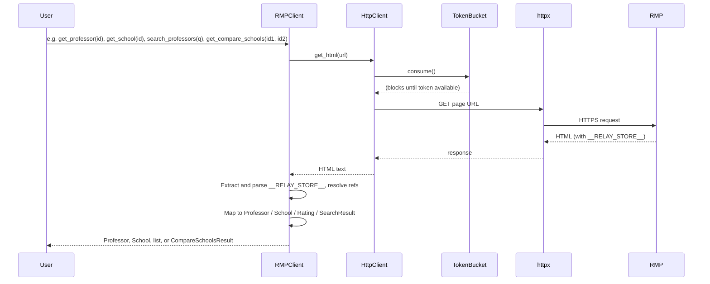
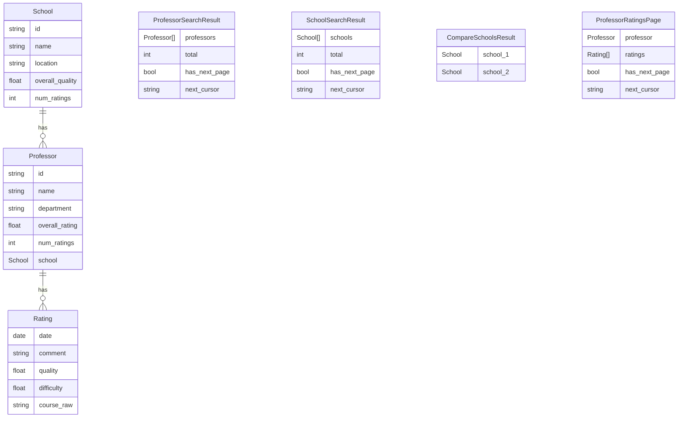
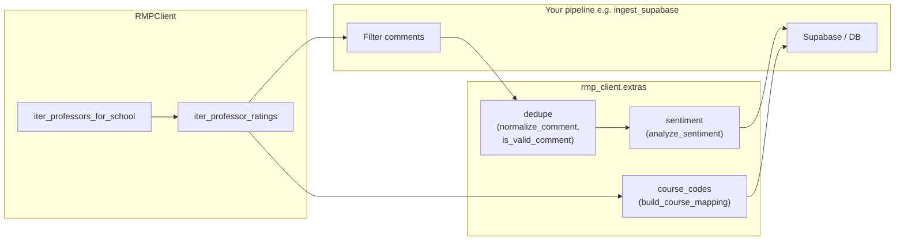
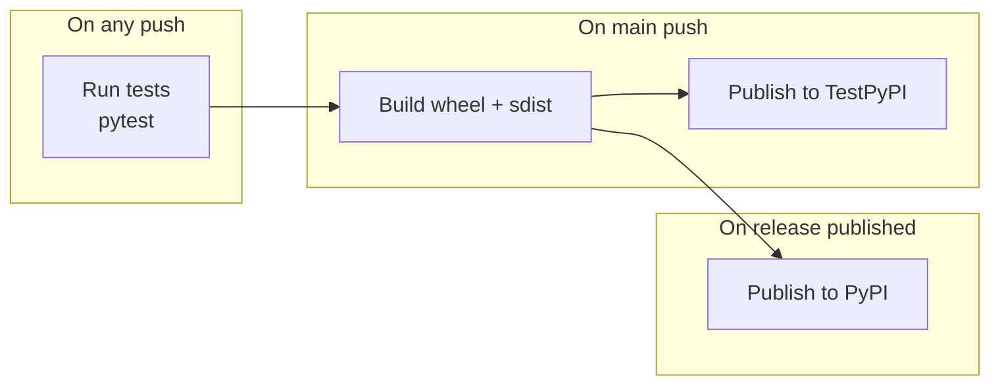

# RateMyProfessors API Client

Typed, retrying, rate-limited unofficial client for RateMyProfessors, with optional
helpers for ingestion workflows (sentiment, dedupe, course-code normalization).

> Note: This library is **unofficial** and may break if RMP changes their internal API.
> This library has been made open-source so that if/when there are any changes,
> someone is able to take note of these changes and help to contribute an update.

## Installation

```bash
pip install ratemyprofessors-client
```

With optional sentiment extras (TextBlob):

```bash
pip install 'ratemyprofessors-client[sentiment]'
```

## Quickstart

**Professor by ID** (data from professor page HTML):

```python
from rmp_client import RMPClient

with RMPClient() as client:
    professor = client.get_professor("2823076")  # legacy ID from URL
    print(professor.name, professor.overall_rating, professor.num_ratings, professor.school.name)
```

**School by ID** (data from school page HTML):

```python
with RMPClient() as client:
    school = client.get_school("1466")
    print(school.name, school.location, school.overall_quality, school.num_ratings)
```

**Search professors or schools** (data from search page HTML):

```python
with RMPClient() as client:
    profs = client.search_professors("test")
    print(profs.total, profs.has_next_page)
    for p in profs.professors[:5]:
        print(p.name, p.school.name if p.school else "")

    schools = client.search_schools("queens")
    for s in schools.schools:
        print(s.name, s.location)
```

**Compare two schools** (data from compare page HTML):

```python
with RMPClient() as client:
    result = client.get_compare_schools("1466", "1491")
    print(result.school_1.name, result.school_2.name)
```

**Iterate professor ratings** (first page from HTML, further pages via GraphQL):

```python
from datetime import date
from rmp_client import RMPClient

with RMPClient() as client:
    for rating in client.iter_professor_ratings("2823076", since=date(2024, 1, 1)):
        print(rating.date, rating.quality, rating.comment)
```

**Verify the client** (run the script to hit the live site and print sample data):

```bash
pip install -e .
python scripts/verify_client.py              # up to 3 pages of ratings per section (default)
python scripts/verify_client.py --max-pages 10 --page-size 20  # scrape more pages
```

**Scrape all ratings** for a professor or school: the client fetches the first page from HTML and subsequent pages via the site’s GraphQL API. Use the iterators to get every rating:

```python
with RMPClient() as client:
    for rating in client.iter_professor_ratings("2823076"):
        print(rating.date, rating.comment)
    for rating in client.iter_school_ratings("1466"):
        print(rating.date, rating.comment)
```

## How it works

### Package architecture


### Request flow

Professor, school, compare-schools, and search endpoints **fetch the relevant RMP page HTML** (GET), extract `window.__RELAY_STORE__` from the response, and parse it into `Professor`, `School`, `Rating`, or search result lists.

**Ratings pagination (Relay):** The first page of professor or school ratings comes from the same HTML (Relay store). The store’s connection includes:

- **`pageInfo.endCursor`** — opaque cursor for “start after this item”
- **`pageInfo.hasNextPage`** — whether more ratings exist

The client then requests the next page by POSTing to `/graphql` with the same query and variables:

- `id` — Relay node id (base64 of `Teacher-{legacyId}` or `School-{legacyId}`)
- `first` — page size (e.g. 20)
- `after` — `pageInfo.endCursor` from the previous response

Loop until `hasNextPage` is false. The cursor is typically base64 for an internal offset (e.g. `YXJyYXljb25uZWN0aW9uOjQ=` decodes to `arrayconnection:4`, meaning “after item 4”). RMP does not rotate or expire these cursors, so you can paginate with plain HTTP requests without a browser. This client sends the **full GraphQL query** in each request; if the site ever required persisted queries (e.g. `doc_id` only), you’d capture the real request from the browser and reuse that format.



### Data models



### Extras and ingestion pipeline



### CI/CD (publish to PyPI)



## Extras

Optional helpers live under `rmp_client.extras`:

- `rmp_client.extras.sentiment.analyze_sentiment`
- `rmp_client.extras.dedupe.normalize_comment` / `is_valid_comment`
- `rmp_client.extras.course_codes.build_course_mapping`

See `docs/` and `examples/` for more. This repo also includes an
`examples/ingest_supabase.py` script that mirrors a Supabase-centric
scraping pipeline using this client.

## Publishing to PyPI

This project follows the [Python Packaging User Guide](https://packaging.python.org/en/latest/overview/) and uses [PyPI Trusted Publishing](https://docs.pypi.org/trusted-publishers/) with GitHub Actions.

1. **One-time setup**: On [pypi.org](https://pypi.org/manage/account/publishing/) add a trusted publisher for this repo (workflow `publish-to-pypi.yml`, environment `pypi`). Create a `pypi` environment in the repo and enable “Required reviewers” for production releases.
2. **Release**: Create and push a tag (e.g. `v0.1.0`). The workflow builds both a [wheel and an sdist](https://packaging.python.org/en/latest/overview/#python-binary-distributions) and publishes to PyPI. Any push builds and publishes to TestPyPI (use the `testpypi` environment).

Local build (no publish):

```bash
pip install build
python -m build
# Outputs in dist/: .whl (wheel) and .tar.gz (sdist)
```
