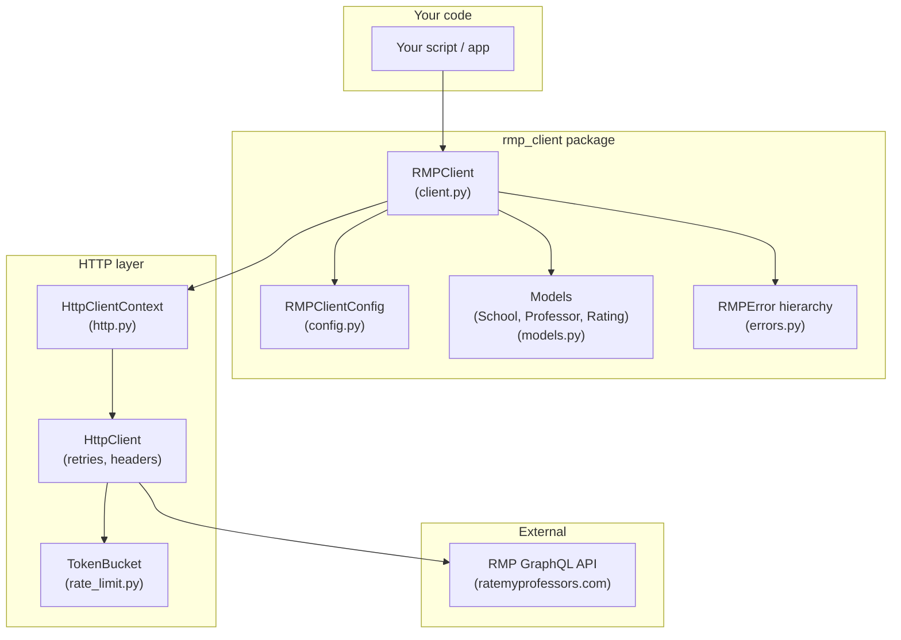
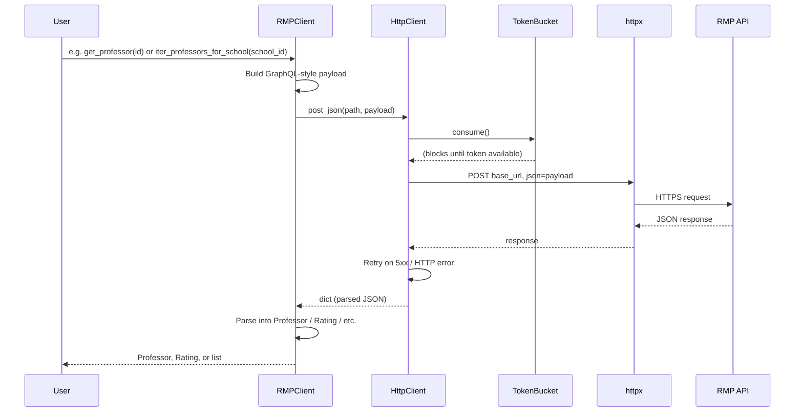
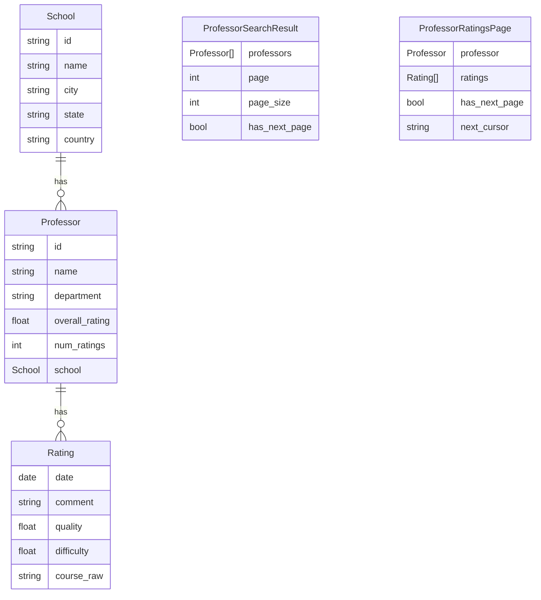
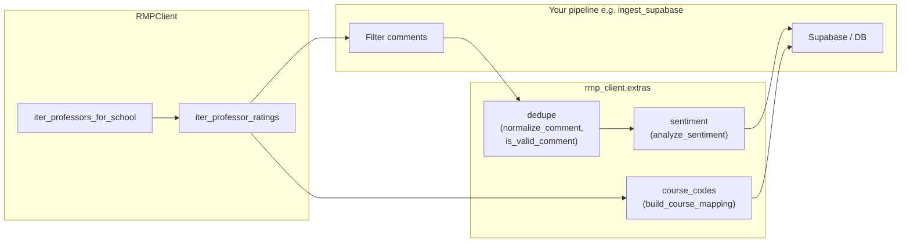
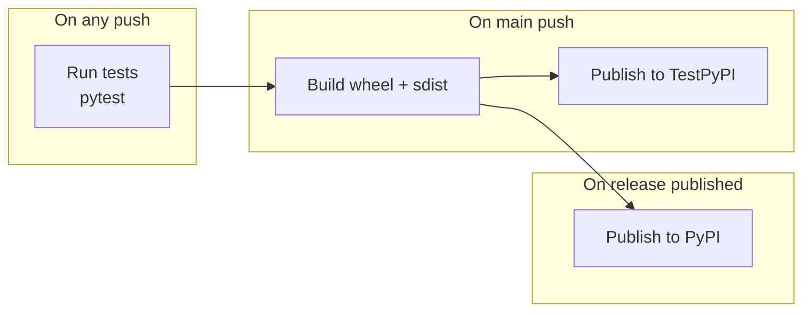

# RateMyProfessors API Client

Typed, retrying, rate-limited unofficial client for RateMyProfessors, with optional
helpers for ingestion workflows (sentiment, dedupe, course-code normalization).

> Note: This library is **unofficial** and may break if RMP changes their internal API.
> This library has been made open-source so that if/when there are any changes,
> someone is able to take note of these changes and help to contribute an update.

## Installation

```bash
pip install ratemyprofessors-client
```

With optional sentiment extras (TextBlob):

```bash
pip install 'ratemyprofessors-client[sentiment]'
```

## Quickstart

```python
from rmp_client import RMPClient

SCHOOL_ID = 1466  # example: Queen's University ID on RMP

with RMPClient() as client:
    for prof in client.iter_professors_for_school(SCHOOL_ID, page_size=20):
        print(prof.name, prof.overall_rating, prof.num_ratings)
```

Fetch details and iterate ratings incrementally:

```python
from datetime import date
from rmp_client import RMPClient

with RMPClient() as client:
    professor = client.get_professor("PROFESSOR_ID")

    for rating in client.iter_professor_ratings(professor.id, since=date(2024, 1, 1)):
        print(rating.date, rating.quality, rating.comment)
```

## How it works

### Package architecture



### Request flow



### Data models



### Extras and ingestion pipeline



### CI/CD (publish to PyPI)



## Extras

Optional helpers live under `rmp_client.extras`:

- `rmp_client.extras.sentiment.analyze_sentiment`
- `rmp_client.extras.dedupe.normalize_comment` / `is_valid_comment`
- `rmp_client.extras.course_codes.build_course_mapping`

See `docs/` and `examples/` for more. This repo also includes an
`examples/ingest_supabase.py` script that mirrors a Supabase-centric
scraping pipeline using this client.

## Publishing to PyPI

This project follows the [Python Packaging User Guide](https://packaging.python.org/en/latest/overview/) and uses [PyPI Trusted Publishing](https://docs.pypi.org/trusted-publishers/) with GitHub Actions.

1. **One-time setup**: On [pypi.org](https://pypi.org/manage/account/publishing/) add a trusted publisher for this repo (workflow `publish-to-pypi.yml`, environment `pypi`). Create a `pypi` environment in the repo and enable “Required reviewers” for production releases.
2. **Release**: Create and push a tag (e.g. `v0.1.0`). The workflow builds both a [wheel and an sdist](https://packaging.python.org/en/latest/overview/#python-binary-distributions) and publishes to PyPI. Any push builds and publishes to TestPyPI (use the `testpypi` environment).

Local build (no publish):

```bash
pip install build
python -m build
# Outputs in dist/: .whl (wheel) and .tar.gz (sdist)
```
